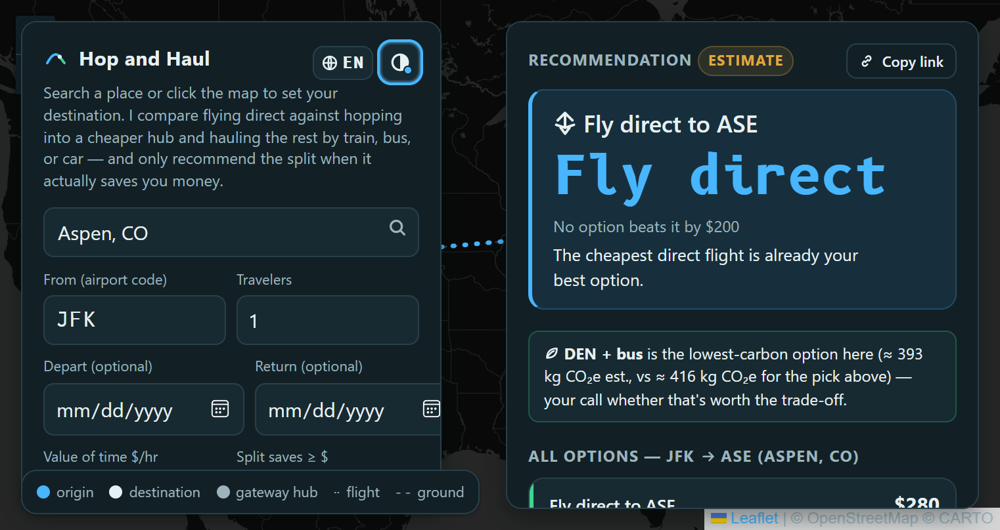
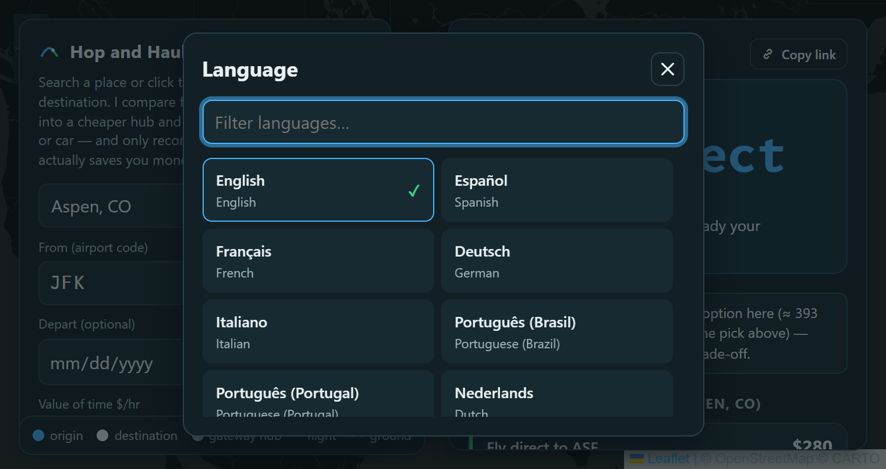
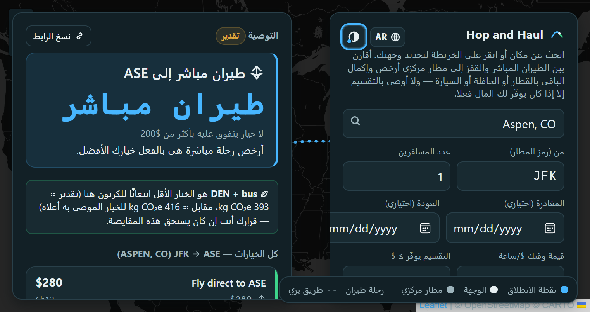

# Hop and Haul

**Flies you into the airport that's actually cheap, then tells you honestly whether the
train ride from there is worth it.**

[](https://github.com/munzzyy/hopandhaul/actions/workflows/ci.yml)
[](LICENSE)




Click anywhere on the map and a recommendation card slides in — cost, time, and a CO2
estimate for every option side by side. A copy-link button turns the plan into a URL you
can send someone. That's a live screenshot, not a mockup; run it yourself below with no
API keys (about 30 seconds), then open
`http://127.0.0.1:8770/?lat=39.1911&lng=-106.8175&place=Aspen,+CO&origin=JFK`
to reproduce a trip like it.

<details>
<summary><b>20-second demo — plan a trip, switch the UI to French, then flip the whole layout to Arabic</b></summary>


</details>

## The idea

Sometimes the cheapest way to get somewhere isn't flying there directly. It's flying into a
nearby hub where flights are cheap and plentiful, then covering the last leg by train, bus,
ferry, or rental car.

Google Flights and Kayak will search nearby airports for you. None of them tell you whether
the split is actually worth it once you account for the extra hours. Hop and Haul does
exactly that one thing: prices the direct flight, prices every reasonable
fly-into-a-cheaper-hub-then-ground alternative, and applies one rule.

**The $200 rule:** only recommend the split if it saves $200 or more (this is a flag, change
it), unless the split is flatly better on both cost and time, or the extra hours are worth it
at your own stated value of time (`--vot`, $/hour).

If a split doesn't clear that bar, it recommends flying direct, even if the split
"technically" saved money. Marginal savings for hours of your day isn't a deal, and the tool
says so instead of just showing you the cheapest number.

## Quick start

```
git clone https://github.com/munzzyy/hopandhaul
cd hopandhaul
pip install -e .
hopandhaul-serve
```

Then open `http://127.0.0.1:8770` and click anywhere on the map.

No API keys needed to try it. Without them the app runs on transparent distance-based
estimates (see below). Add keys later for live fares; nothing else changes.

## What's real vs estimated

- **Live fares (Duffel, or Amadeus as a fallback)**: actual priced itineraries, when you set
  `DUFFEL_API_KEY` (or the Amadeus pair). No key set and no date entered falls back to
  estimates automatically, and the response says so.
- **Fare and ground-leg ESTIMATES**: a deterministic formula (distance, route-market
  competition, airport size, booking date) calibrated against real fares, not a live quote.
  Every estimate-based response is labeled `"pricing_source": "estimate"` and says so in
  plain English in the UI. It's a model, not a promise, so verify before booking.
  Ground-transport costs and times (train/bus/drive) are always estimates; there's no free,
  open multimodal fares API worth calling here.
- **Weather (OpenWeather)** and **geocoding/place search (Geoapify)** are both real, live,
  optional integrations. Off entirely if you don't set their keys.

## Features

- Deterministic split-vs-direct engine with the $200 rule (configurable threshold and value
  of time)
- Group-aware costs (per-person fares scale by travelers; a rental car doesn't)
- Round-trip aware (real return pricing when the provider supports it, a stated estimate
  otherwise)
- Gateway discovery — curated hub suggestions plus geometric fallback search, worldwide
- Click-anywhere map UI (Leaflet self-hosted; map tiles stream from CARTO's servers)
- UI in 46 languages, four of them fully right-to-left, behind a hand-rolled i18n runtime
  instead of a framework — pick yours from the globe button
- Eight themes plus Auto, picked from the header: Departure Board, Boarding Pass, Night
  Flight (OLED), a CRT-amber Terminal, High Contrast, Rail Poster, Old Map, and Coastal
- Destination weather for the date you're planning
- Cheapest vs greenest: a rough CO2 estimate per option, with the lowest-carbon one flagged
  separately from the recommendation — estimates, not a certified footprint, and never used to
  pick a winner for you
- Zero runtime dependencies — pure Python standard library, no `npm install`, no build step

## Speaks your language

The whole UI ships in 46 languages — the big ones, plus Catalan, Icelandic, Swahili,
Filipino, and both Chinese scripts. Arabic, Hebrew, Persian, and Urdu mirror the entire
layout right-to-left, map panels included. Detection follows your browser, your pick
sticks in localStorage, and a language whose catalog fails to load falls back to English
instead of breaking.

| | |
|---|---|
|  |  |

Native speaker and you spot something off? A translation fix in
`src/hopandhaul/ui/i18n/<code>.json` is about the friendliest PR there is.

## Architecture, briefly

- `trip.py`: the $200-rule math. Given a set of priced options, decides what to recommend and
  why.
- `geo.py`: the estimation model. Nearest airport, gateway discovery, and the distance-based
  fare/ground formulas.
- `duffel.py` / `providers.py`: live flight pricing (Duffel primary, Amadeus fallback).
  `flights.py` picks whichever is configured.
- `geoapify.py` / `weather.py`: geocoding and destination weather, both optional.
- `server.py`: the stdlib `http.server` app. Serves the UI and the JSON API, nothing else.

Every one of these is a plain, readable module you can open and check the reasoning of, not a
black box. See `docs/api.md` for the exact HTTP contract.

## Self-tests

Every module ships an offline self-test — no keys, no network, under a second total:

```
python -m hopandhaul.trip --selftest
python -m hopandhaul.geo --selftest
python -m hopandhaul.server --selftest
python -m hopandhaul.emissions --selftest
python -m hopandhaul.duffel --selftest
python -m hopandhaul.geoapify --selftest
python -m hopandhaul.weather --selftest
python -m hopandhaul.providers --selftest
```

## Configuration (all optional)

Set environment variables for whichever keys you have — `DUFFEL_API_KEY` (or the Amadeus
pair), `GEOAPIFY_API_KEY`, `OPENWEATHER_API_KEY`. Env vars always win and work for both a
repo checkout and a real `pip install`. Nothing here is required to run the app in estimate
mode.

Free tiers, if you want to add a key:

- **Duffel** — [app.duffel.com/join](https://app.duffel.com/join), instant sandbox access, no
  card required. A test-mode key (`duffel_test_...`) is enough to see live-shaped pricing
  logic; it just prices Duffel's own test airline instead of real fares.
- **Geoapify** — [geoapify.com](https://www.geoapify.com/), free without a card, 3,000
  geocoding requests/day. Powers the place-search box and reverse geocoding.
- **OpenWeather** — [openweathermap.org/api](https://openweathermap.org/api), free without a
  card. Powers the destination weather chip; takes up to ~2 hours to activate after signup.

If you're working from a repo checkout (not a wheel install), there's also a
`secrets.local.example.json` you can copy to `src/hopandhaul/secrets.local.json` and fill in
instead — see that file for the full key list. It's a convenience for local dev only: it
isn't packaged into the wheel, so it isn't available after a normal `pip install`.

## What this isn't

Not a booking site. It points you at the real flight/train/bus booking pages and stops
there. Not a price-prediction or buy-or-wait tool. Not a points/miles optimizer. Not a
hidden-city fare finder. No AI in the runtime path: the recommendation is deterministic math
you can read in `trip.py`, not a model's guess.

## Contributing / License / Security

See [CONTRIBUTING.md](CONTRIBUTING.md) for how to run tests and the code-style/voice
expectations, [LICENSE](LICENSE) (Prosperity Public License, free for noncommercial use), and [SECURITY.md](SECURITY.md) for the security
posture and how to report a vulnerability.
